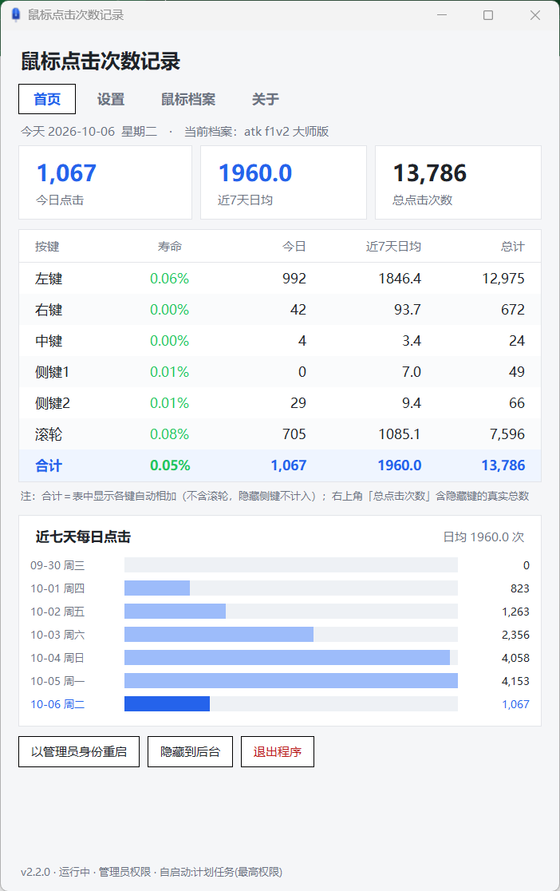

# 鼠标点击次数记录

Windows 下的鼠标按键点击次数统计小工具：底层鼠标钩子计数 + tkinter 统计窗口 + 右下角托盘常驻，单文件 exe，免安装、不依赖 Python。

## 碎碎念

上一个鼠标用了一年半因为左键双击报废了，为了记录新鼠标的使用次数和频率，用deepseek-v4.1-flash花了2.56元完成该软件，功能单一仅供娱乐。

## 能做什么

- 统计 **左键 / 右键 / 中键 / 侧键1 / 侧键2** 五类按键的点击次数
- 窗口里显示四列：**今日**、**本周日均**（周一起算）、**近 7 天日均**、**总计**
- 右下角托盘常驻：左键唤回窗口，右键弹出菜单（控制面板 / 关闭程序），悬停显示「今日 N 次｜总计 N 次」
- **支持统计游戏内点击**：双击 exe 会弹出 UAC 提权确认，允许后即可统计带反作弊的游戏（如明日方舟：终末地）里的点击；点「否」也不影响普通软件统计。窗口里有「以管理员身份重启」按钮可临时切换权限
- 状态栏实时显示当前权限（管理员/普通）、钩子自诊断（正常/疑似被拦截）和今日次数；检测到钩子被拦截会自动重装尝试自愈
- 支持开机自启动，可一键开关；管理员权限下自动注册为「最高权限」计划任务——开机静默驻留托盘、不弹 UAC，游戏内点击照常统计
- 自启动可迁移：整个文件夹换位置、换电脑后，手动打开一次程序即自动修复启动项
- 单实例运行：重复启动只会把已有窗口叫回来，不会开出第二个
- 数据按天存成本地 json，自动保存（最多丢 3 秒数据）；exe 放在不可写目录时数据自动改存用户目录，不丢记录



## 快速上手

**方式一：直接用 exe**

去 [Releases](../../releases) 下载压缩包，解压后双击 `鼠标点击次数记录.exe`。

解压后的目录结构：

```
鼠标点击计数\
  鼠标点击次数记录.exe              主程序
  使用说明.txt                      详细使用说明
  点击数据记录（勿删！！！）.json    你的历史记录，首次点击后自动生成
  其他文件\
      icon.ico                      托盘与窗口图标
      启动.bat                      等价于双击 exe
      设置开机自启动.bat
      取消开机自启动.bat
```

exe 移走后请连同 `其他文件` 文件夹一起移动。

**方式二：从源码运行**

```powershell
python mouse_counter.py
```

## 环境要求

- Windows 10 / 11 x64
- 从源码运行需要 Python 3.10（只用标准库，**没有任何第三方依赖**）

## 资源占用

用的是 Windows 底层鼠标钩子 `WH_MOUSE_LL`，回调里只做计数和入队，不阻塞鼠标输入。空闲时 CPU 占用约 0%，内存约 50 MB，窗口隐藏后同样保持监听。

任务管理器里会看到两个同名进程——这是单文件 exe 的正常现象（一个是解包引导，一个是主程序），只有主程序带窗口。

## 从源码打包 exe

需要 PyInstaller（`python -m pip install pyinstaller`）：

```powershell
python -m PyInstaller --noconfirm --clean --onefile --noconsole `
  --name "鼠标点击次数记录" `
  --icon "icon.ico" `
  "mouse_counter.py"
```

## 卸载

1. 双击 `其他文件\取消开机自启动.bat`（或托盘菜单取消勾选）
2. 托盘右键 → 关闭程序
3. 删除整个文件夹

## 已知限制

- Windows 11 默认把新托盘图标收进「^ 隐藏的图标」，只能手动拖出来常驻，无法用程序强制
- 中键 / 侧键只有鼠标真的发出对应消息时才会计数
- 未统计滚轮，未做多显示器 DPI 特殊处理
- exe 未做代码签名：首次在别的电脑运行可能弹 SmartScreen 提示，点「更多信息 → 仍要运行」即可
- 若 exe 所在文件夹不可写（如 Program Files），数据会自动改存 `%LOCALAPPDATA%\鼠标点击次数记录\`

## 其他

版本变更记录见 [更新日志.md](更新日志.md)，当前版本 **v1.1.0**。

更偏开发者视角的结构拆解、关键机制与踩坑记录见 [项目说明.md](项目说明.md)。
